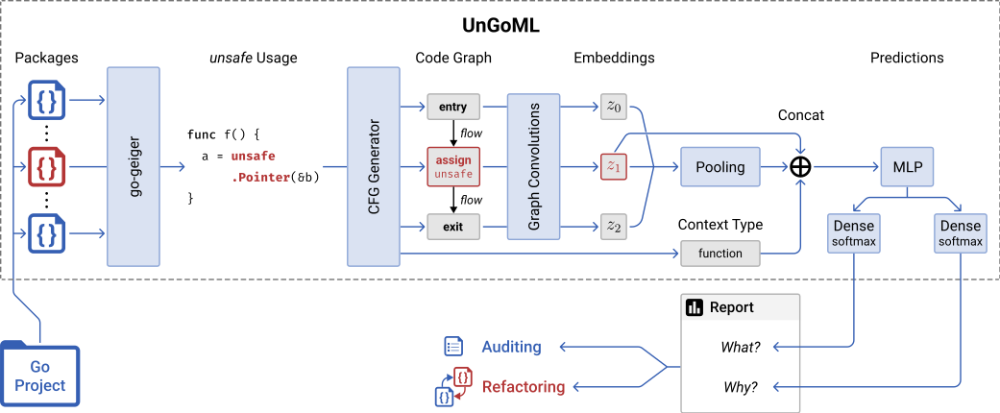

# Unsafe Toolkit

The usage of the unsafe library in Go allows developers to circumvent its memory
protection and can introduce security vulnerabilities. `go-geiger` helps developers
to spot usages of unsafe in their code. Machine learning can be used to classify
the reason and context of this usage.

This toolkit should provide a wrapper / Docker container for
<https://github.com/Cortys/unsafe-go-classifier>. Snippets of Go code should be given as a parameter for a container. The container will then analyze the code for unsafe usages and try to classify it.



## Installation (local)

### Prerequisites

You should have the unsafe-go-classifier image downloaded and tagged as usgoc/pred:latest.
Pull the unsafe-go-classifier from <https://github.com/Cortys/unsafe-go-classifier>.

Also, install go-geiger and make sure it's located in one of your path variables.
<<<<<<< HEAD
To install the Python dependencies, run the following command `pip install -r requirements.txt`.
You may want to install these packages in a local environment instead of global: `$python3 -m venv .venv ` `$source .venv/bin/activate`.
=======
To install the Python dependencies, run the following command `pip install -r requirements.txt`
>>>>>>> parent of b4f2d6d (Add anonymized repositories)
If you want to pull SSH repositories with this tool, make sure you have working SSH access. 

## Installation (Docker machine)

### Prerequisites

You should have the unsafe-go-classifier image downloaded and tagged as usgoc/pred:latest.
Pull the unsafe-go-classifier from <https://github.com/Cortys/unsafe-go-classifier>.
Also, make sure you execute the script with a user which has access to Docker.

### Building the image

Execute the following command to build the image:

`sudo docker build . -t unsafe-go-toolkit`

## Running the runner script for Docker

Run the run.py file with the following arguments to export analysis data from a file/project:

```
usage: run.py [-h] -p PROJECT [-o OUTPUT] [-v VISUALIZER_ARGS] [-d]

optional arguments:
  -h, --help            show this help message and exit
  -p PROJECT, --project PROJECT
                        Project path
  -o OUTPUT, --output OUTPUT
                        Output path
  -v VISUALIZER_ARGS, --visualizer-args VISUALIZER_ARGS
                        Arguments for the visualizer as a string, use of input argument is not recommended
  -d, --debug           Verbose mode
```

The visualizer args should be given in quotes and will then be passed in the container. Note that the output should be in the mounted output directory, because the run.py script mounts only that directory to the host files system. 

Example usage: 

`./run.py -p https://github.com/jlauinger/go-safer.git`

## Arguments for the evaluation

Run the evaluate.py file with the following arguments to export analysis data from a file/project:

```
usage: evaluate.py [-h] [-p PROJECT] [-o OUTPUT] [-m MODE] [-d] [-c CONCURRENT_THREADS]

optional arguments:
  -h, --help            show this help message and exit
  -p PROJECT, --project PROJECT
                        Path of package where the Go file lies in
  -o OUTPUT, --output OUTPUT
                        Output file of JSON file
  -m MODE, --mode MODE  Mode of output file, choose between the strings readable or machine
  -d, --debug           Debug mode
  -c CONCURRENT_THREADS, --concurrent-threads CONCURRENT_THREADS
                        Number of concurrent evaluation containers the script should run
```


`./evaluate.py -p git@github.com:jlauinger/go-safer.git`

## Arguments for the visualizer

Run the visualize.py with the following arguments to visualize your acquired analysis:

```
usage: visualize.py [-h] -i INPUT [-o OUTPUT] [-t TYPE]

optional arguments:
  -h, --help            show this help message and exit
  -i INPUT, --input INPUT
                        Path of input JSON file
  -o OUTPUT, --output OUTPUT
                        Path of output visualized folder
  -t TYPE, --type TYPE  File type of output graphs
```

`./visualize.py -i output/output.json /output`


## Usage examples

This example runs the analysis on the go-safer repository and saves the data on a custom file location.

`./run.py -p https://github.com/jlauinger/go-safer.git -o output/go_safer.json`

This example runs the same analysis as above, but with custom visualizer args.

`./run.py -p https://github.com/jlauinger/go-safer.git -o output/go_safer.json --visualizer-args "-t svg"`

## Testing

This project can be tested using the tests.py file and the following command:

`python3 -m unittest tests.py`

You can also run the tests in Visual Studio Code, the test settings have been preconfigured.

Some tests are version and package specific, so the paths for the tests should be updated to the corresponding packages.